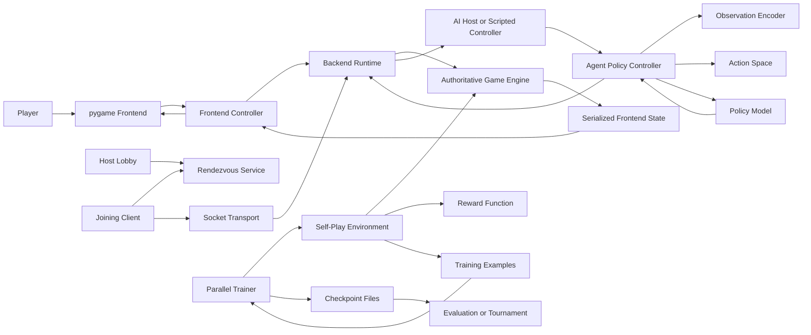

# Monopoly

Monopoly is a Python Monopoly project with three major layers built around the same game engine:

- A rules-driven game model in `src/monopoly`.
- A `pygame` GUI with local play, online lobby support, save/load, replay, and debug tooling.
- An RL/agent stack that can train, evaluate, benchmark, and tournament AI checkpoints against each other or against scripted opponents.

The same engine powers human play, GUI interactions, saved games, AI turn execution, and offline training. That keeps the runtime behavior consistent across the project instead of maintaining separate code paths for gameplay and AI.

For contributor-oriented workflows and quick debug commands, see [DEVELOPMENT.md](DEVELOPMENT.md).

## Features

- Full Monopoly rules engine with properties, rent, jail, auctions, mortgages, buildings, trades, cards, saving, and restore.
- `pygame` frontend with lobby setup, AI slot assignment, online session discovery, and a debug editor.
- Structured file logging for frontend and backend processes.
- RL agent pipeline with action masking, observation encoding, reward shaping, self-play training, checkpoints, evaluation, benchmarks, and tournaments.
- Scripted AI profiles for baseline opponents and league-style self-play.
- Automated tests across engine, GUI support layers, networking, and agent utilities.

## Project Layout

```text
.
|-- main.py
|-- train_agent.py
|-- evaluate_agent.py
|-- tournament_checkpoints.py
|-- run_tests.py
|-- requirements.txt
|-- src/monopoly/
|   |-- game.py
|   |-- board.py
|   |-- rules.py
|   |-- cards.py
|   |-- spaces.py
|   |-- player.py
|   |-- trading.py
|   |-- api.py
|   |-- logging_utils.py
|   |-- gui/
|   |   |-- launcher.py
|   |   |-- backend_process.py
|   |   |-- transport.py
|   |   |-- rendezvous.py
|   |   `-- pygame_frontend/
|   `-- agent/
|       |-- action_space.py
|       |-- features.py
|       |-- heuristics.py
|       |-- reward.py
|       |-- model.py
|       |-- controller.py
|       |-- environment.py
|       |-- trainer.py
|       |-- evaluation.py
|       |-- league.py
|       |-- scripted.py
|       `-- worker_pool.py
`-- tests/
```

## Requirements

- Python 3.11 or newer
- Windows, macOS, or Linux
- A desktop environment for the `pygame` GUI
- Optional CUDA-capable PyTorch install if you want GPU training

The repository currently targets editable local installs and uses `setuptools` via `pyproject.toml`.

## Setup

### 1. Create and activate an environment

Windows PowerShell:

```powershell
python -m venv .venv
.\.venv\Scripts\Activate.ps1
```

macOS or Linux:

```bash
python -m venv .venv
source .venv/bin/activate
```

If you prefer conda, create an environment with Python 3.11+ and activate it before installing dependencies.

### 2. Install PyTorch first

PyTorch should be installed before the rest of the dependencies so you can choose the correct build for your machine.

CPU-only example:

```bash
python -m pip install torch
```

CUDA example:

```bash
python -m pip install torch --index-url https://download.pytorch.org/whl/cu124
```

Choose the CUDA wheel that matches your driver and toolkit support. If you are not training on GPU, install the CPU build.

### 3. Install the remaining dependencies

```bash
python -m pip install --upgrade pip
python -m pip install -r requirements.txt
```

That installs the remaining runtime dependencies and the local package in editable mode using `-e .` without overwriting the PyTorch build you selected earlier.

## Running the Project

## Launch the GUI game

```bash
python main.py
```

What this does:

- Starts the rendezvous service used for online lobby discovery.
- Starts the `pygame` frontend process.
- Lets the frontend spin up and communicate with a backend game process.

By default, `main.py` launches the GUI with `DEBUG_MODE = False`. If you want the debug editor, set `DEBUG_MODE = True` in `main.py` before starting the app.

## Local play in the GUI

Use the setup screen to:

- choose player count
- assign each seat as human or AI
- select AI checkpoints or scripted AI profiles for AI seats
- configure AI action cooldown speed per AI seat
- start a new local game

The frontend sends commands to the backend process, which owns the authoritative `Game` object and returns serialized frontend state for rendering.

## Online play in the GUI

The GUI supports host-authoritative online sessions.

Runtime flow:

1. The host creates an online lobby.
2. The backend registers the lobby with the rendezvous process.
3. Joining clients resolve the session code through the rendezvous service.
4. Clients connect to the host backend through the socket transport layer.
5. The host backend remains authoritative for game state and broadcasts updates.

Relevant components:

- `src/monopoly/gui/rendezvous.py`: session-code registration and resolution
- `src/monopoly/gui/transport.py`: framed socket request/response and event transport
- `src/monopoly/gui/backend_process.py`: authoritative backend runtime, lobby state, AI seat handling, save/load, debug, and action execution
- `src/monopoly/gui/pygame_frontend/app.py`: GUI flow, prompts, board rendering, and debug UI

## Save and load

The backend exposes save/load support through the GUI. Game state is serialized by the engine and can be restored later, including interactive state needed to continue an unfinished turn.

## Logging

The project uses rotating file logs with a shared format:

```text
YYYY-MM-DD HH:MM:SS | LEVEL    | logger.name | message
```

Default log directory:

- `logs/`

Typical log files:

- `logs/frontend.log`
- `logs/backend.log`

Relevant environment variables:

- `MONOPOLY_LOG_DIR`: override the log folder
- `MONOPOLY_LOG_LEVEL`: set log verbosity such as `DEBUG`, `INFO`, or `WARNING`

## Running Tests

Run the full test suite with coverage:

```bash
python run_tests.py
```

You can also run pytest directly for focused suites:

```bash
python -m pytest
python -m pytest tests/test_game.py
python -m pytest tests/test_agent.py -k action_space
```

## How the Core Game Works

The engine lives in `src/monopoly/game.py` and coordinates the full turn state machine.

Key engine responsibilities:

- create and own players, board, dice, and turn state
- resolve movement and landing effects
- handle auctions, jail decisions, property purchase decisions, and trades
- validate legal actions and expose them as serialized turn plans
- support save/load and full-state restoration

Supporting engine modules:

- `board.py`: builds the standard board and card decks
- `rules.py`: rent, mortgage, and building validation logic
- `spaces.py`: typed board-space models
- `cards.py`: Chance and Community Chest deck definitions and effects
- `player.py`: mutable player state
- `trading.py`: trade validation and execution
- `api.py`: serialized views used by frontend, online runtime, and agents

## How the GUI Works

The GUI is process-based rather than embedding everything in one loop.

Main responsibilities by component:

- `main.py`: application entry point
- `src/monopoly/gui/launcher.py`: starts rendezvous and frontend processes
- `src/monopoly/gui/pygame_frontend/app.py`: top-level GUI application, screens, prompts, and debug tools
- `src/monopoly/gui/pygame_frontend/controller.py`: client-side orchestration between GUI and backend
- `src/monopoly/gui/pygame_frontend/board.py`: board rendering
- `src/monopoly/gui/backend_process.py`: authoritative game runtime and online session management

The frontend does not implement game rules itself. It renders serialized state, offers user actions, and sends actions back to the backend.

## Runtime Flow Diagram



Interpretation:

- The GUI only renders state and submits commands.
- The backend owns the authoritative game state and applies all legal actions.
- Online discovery happens through the rendezvous service, but actual gameplay traffic goes through the host backend.
- AI decisions use the same legal-action interface as human commands.
- Training reuses the same engine through the self-play environment, then writes checkpoints that can be evaluated or tournamented later.

## How the Agent Stack Works

The RL code lives in `src/monopoly/agent`.

Pipeline overview:

1. The engine exposes legal actions and frontend state.
2. `features.py` encodes state into a fixed-size observation vector.
3. `action_space.py` expands legal engine actions into a discrete policy action space.
4. `model.py` scores those actions and predicts values.
5. `controller.py` turns model outputs into legal gameplay choices.
6. `environment.py` runs self-play episodes and produces training examples.
7. `reward.py` computes reward shaping between states.
8. `trainer.py` coordinates rollout collection, PPO updates, checkpoints, and optional benchmark runs.

Additional agent support modules:

- `board_analysis.py`: strategic board metrics shared across encoding and evaluation
- `heuristics.py`: optional heuristic priors for action scoring
- `scripted.py`: deterministic or semi-random scripted AI opponents
- `league.py`: self-play snapshot management and league source mixing
- `worker_pool.py`: persistent rollout workers for faster self-play collection
- `evaluation.py`: checkpoint evaluation, benchmarks, Elo summaries, and tournaments
- `checkpoints.py`: checkpoint path resolution and controller loading
- `config.py`: training, policy, heuristic, and reward configuration dataclasses

## Training an Agent

Fresh training run:

```bash
python train_agent.py --iterations 50
```

Before running GPU training, make sure you installed a CUDA-enabled PyTorch build in the environment during setup.

For long-running jobs in `nohup`, `tmux`, CI, or redirected logs, use plain log-style output instead of the interactive progress bars:

```bash
python train_agent.py --iterations 50 --plain_output
```

Resume from a checkpoint:

```bash
python train_agent.py --resume .checkpoints/latest.pt --iterations 20
```

Useful options:

- `--threads`: rollout worker count
- `--episodes-per-thread`: episodes per worker per iteration
- `--max-steps`: environment step cap per episode
- `--max-actions`: raw action cap per episode
- `--players`: players per self-play game
- `--model-type {mlp,transformer}`
- `--device cpu` or `--device cuda`
- `--checkpoint-dir .checkpoints`
- `--checkpoint-interval 5`
- `--plain_output`: disable tqdm progress bars and emit log-style status lines
- `--heuristic-bias` or `--no-heuristic-bias`
- `--league-self-play` or `--no-league-self-play`
- `--benchmark-interval 10`

What training writes:

- periodic checkpoints such as `.checkpoints/iteration_0005.pt`
- final `.checkpoints/latest.pt`
- console summaries for rollout, update, and benchmark phases

Plain-output mode writes line-oriented status updates that are easier to capture in files, for example under Ubuntu:

```bash
nohup python train_agent.py --iterations 200 --plain_output > train.log 2>&1 &
tail -f train.log
```

## Evaluating a Checkpoint

Evaluate one checkpoint:

```bash
python evaluate_agent.py .checkpoints/latest.pt --games 8 --players 2 --device cpu
```

Run a benchmark suite against other checkpoints:

```bash
python evaluate_agent.py .checkpoints/latest.pt --benchmark-opponents .checkpoints/iteration_0050.pt .checkpoints/iteration_0100.pt --games 8 --players 2
```

The evaluation script prints per-run summary metrics including wins, draws, average steps, assets, rent trend, monopoly-denial events, board-strength trend, and auction-bid quality.

## Running a Tournament

Run a fixed-seed tournament across multiple checkpoints:

```bash
python tournament_checkpoints.py .checkpoints/iteration_0050.pt .checkpoints/iteration_0100.pt .checkpoints/latest.pt --games 6 --players 2 --device cpu
```

This produces aggregate tournament summaries plus per-seed matchup results.

## Generated Files and Folders

The project creates several local artifacts during normal use:

- `.checkpoints/`: training checkpoints
- `logs/`: frontend and backend logs
- `.coverage`: coverage data file
- `.pytest_cache/`: pytest cache
- `__pycache__/`: Python bytecode caches

These are local development artifacts and should not be committed.

## Common Workflows

Run the game GUI:

```bash
python main.py
```

Run all tests:

```bash
python run_tests.py
```

Train from scratch on CPU:

```bash
python train_agent.py --iterations 20 --device cpu --threads 2 --plain_output
```

Resume training on GPU:

```bash
python train_agent.py --resume .checkpoints/latest.pt --iterations 20 --device cuda --plain_output
```

Evaluate the latest checkpoint:

```bash
python evaluate_agent.py .checkpoints/latest.pt --games 8 --players 2
```

Tournament three checkpoints:

```bash
python tournament_checkpoints.py .checkpoints/iteration_0020.pt .checkpoints/iteration_0040.pt .checkpoints/latest.pt
```

## Notes

- The default GUI entry point is `main.py`.
- Training now starts from scratch by default; use `--resume` only when you actually want checkpoint resume behavior.
- `--plain_output` is recommended for non-interactive terminals, redirected output, and `nohup` runs.
- For first-time training on a machine without CUDA, pass `--device cpu` explicitly if you want to avoid any ambiguity.
- Logs and checkpoints are intentionally local artifacts and are ignored by `.gitignore`.